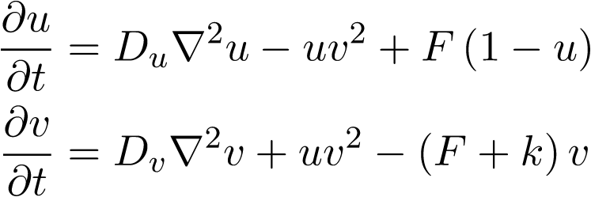

# Laplacian
Semester project focusing on the analysis of portable vector extensions with
application to the 3D Gray-Scott reaction-diffusion system. The project is
based on the [`CubismNova`](https://github.com/cselab/CubismNova) framework.
`CubismNova` is a C++ template library used for solving partial differential
equations on structured uniform or stretched grids. The target compute kernels
will be the discretization of the Laplacian operator found in the diffusion
terms of the Gray-Scott system. The chosen programming model for implementing
portable vector extensions (data-level parallelism) is
[`ISPC`](https://github.com/ispc/ispc/).

## The Gray-Scott system

The Gray-Scott system is composed of two coupled parabolic PDEs which govern
the diffusion and chemical reactions of two chemical species; `U` and `V`.
The equations are coupled through the reaction terms which arises due to the
"law of mass attraction" from reaction kinetics.

The system also has two parameters `F` and `k`, these are the parameters of
focus when carrying out a bifurcation analysis. The feed-rate `F` term
essentially acts as a source-term. A deeper understanding of these
two parameters can be obtained through physical examples from developmental
biology:

* semi-permeable membrane surrounds the computational domain;
* the species `U` is replenished through the membrane from an outside source;
* specifically, replenishment occurs through diffusion through the membrane;
* the feed-rate `F` can be thought off as the membrane's permeability;
* e.g. in biological applications, `U` can be a chemical supplied by blood flow.

For a more detailed treatment of the Gray-Scott system, refer to the semester
project paper (to be linked in the future).

## Running the code

The project is built utilizing the
[`Meson`](https://github.com/mesonbuild/meson) build system. Once the repository
has been cloned, the project can be built easily using the ``meson setup build``
command. For setting up a debug build: 

``meson setup build_debug``

For setting up a release build:

``meson setup build_release --buildtype=release``

All utilized subprojects (known on github as submodules) are included in the
``subprojects`` directory and will be automatically downloaded and initialized
by meson when building the project.$

The Gray-Scott simulation is found in the ``src`` build directory, while
benchmarks, code verification, and unit tests are included in the ``test``
build directory.

## Link to final simulation

[Youtube video of final simulation](https://youtu.be/WRRn_hadOUI)
[Youtube video of final simulation with clipped color bar](https://youtu.be/nQSPNC6QppI)

## Project checklist 
The date within brackets `[dd/mm/yy]` denotes the due date originally assigned 
during the planning of the project. A color code has been utilized to denote 
the "relevance" of the task   
🟢 task necessary for project completion,  
🟡 task optional, but would ideally like to implement.

**March**
* [05/03/21] 🟢 literature research on reaction-diffusion systems           ✔️
* [12/03/21] 🟢 familiarization with CubismNova                             ✔️
* [26/03/21] 🟢 implementation of naive FD kernels                          ✔️

**April**
* [02/04/21] 🟢 implementation of order verification study                  ✔️
* [09/04/21] 🟢 literature research on data-level parallelism               ✔️
* [09/04/21] 🟢 literature research & implementation of benchmark suite     ✔️
* [16/04/21] 🟢 initial implementation of sliced ISPC kernel                ✔️
* [16/04/21] 🟢 performance analysis of naive FD kernels                    ✔️
* [23/04/21] 🟢 optimization of sliced ISPC kernel                          ✔️
* [23/04/21] 🟢 performance analysis of sliced ISPC kernel                  ✔️
* [30/04/21] 🟡 extension of sliced ISPC kernels to 4th-order FDs           ✔️
* [30/04/21] 🟢 finalizing serial Gray-Scott solver                         ✔️

**May**
* [07/05/21] 🟢 extension to non-zero Neumann boundaries                    ✔️
* [14/05/21] 🟢 extension of Gray-Scott solver to TLP                       ✔️
* [14/05/21] 🟢 performance analysis of shared memory code
* [28/05/21] 🟡 solution verification for Gray-Scott solver                 ✔️
* [28/05/21] 🟡 Gray-Scott solver developmental biology applications
* [28/05/21] 🟢 3D volume rendering og Gray-Scott problem for movie         ✔️

**June**
* [04/06/21] 🟢 write-up thesis & create presentation of work               ✔️

Some tasks have been left unfinished due to time constraints. These are to be
included in the future work proposal, along with other identified applications
and investigations of interest.
